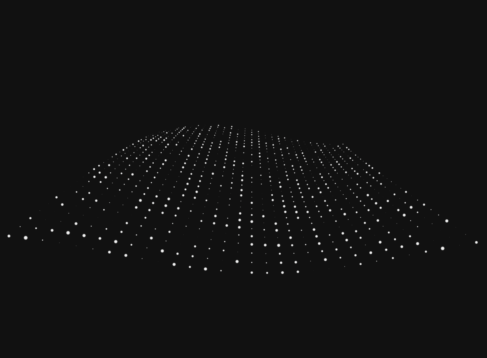
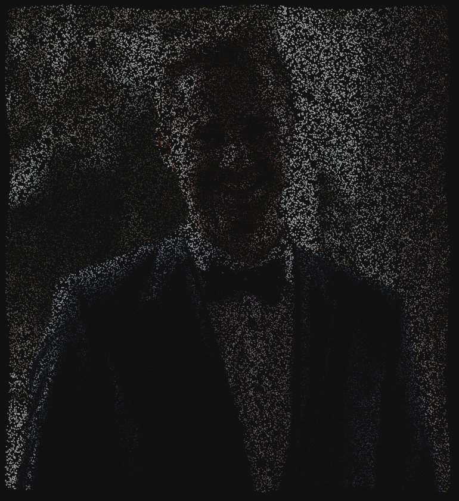

# three.js Objects

A composition of cool 3D accelerated objects.

## What is this?

This is an extension library for [three.js](https://threejs.org/), which
provides some 3D objects ready to use. The main problem I had was to create nice
looking objects for my prototypes. Because creating a prototype is about create
a basic design fast, the development of 3D objects is a bottleneck and slows
down the creation of the prototype.

## Which object classes are implemented?

This repository will be continuously updated and extended by new 3D objects. You
can find all implemented objects in the list below.

| Class        | Description                 |
|:-------------|:----------------------------|
|`ParticleWave` |A plane, which consists of particles to simulate a wave effect|
|`ParticleImage`|Random particles representing pixel colors of an image|

## How do I use this?

Import an object and add it to the three.js scene. The `options` argument
contains parameters of the object.

```js
import { ParticleWave } from "threejs-objects";

const wave = new ParticleWave(options);
scene.add(wave);
```

## Reference

### ParticleWave

#### Options

| Parameter | Type | Default | Description |
|:----------|:-----|:--------|:------------|
| `numberParticles` | array  | `[50, 50]` | Amount of particles in x and y direction |
| `particleSize`    | number | `0.025`    | The size of a particle will be between 0 and `particleSize` |
| `particleTexture` | string |            | Path to the texture of the particles |
| `waveHeight`      | number | `1.0`      | Amplitude of the wave |
| `noise`           | number | `0.0`      | A value greater than `0` will add noise to the position of each particle |

#### Example

```js
const wave = new ParticleWave({
  numberParticles: [30, 30],
  particleTexture: "images/circle.png",
  waveHeight: 0.05
});
```

<details>
  <summary>Result</summary>
  
</details>

### ParticleImage

#### Options

| Parameter | Type | Default | Description |
|:----------|:-----|:--------|:------------|
| `image`   | string | | Path to the image file |
| `useImageColors` | bool | `false` | If the shaders should render the actual pixel colors |
| `amplitude` | number | `0.05` | The amplitude of the wave effect |
| `color` | Color | `Color(1.0, 1.0, 1.0)` | If `!useImageColors`, this option sets the color of each particle |
| `particleTexture` | string | | Path to the texture of the particles |
| `numberParticles` | number | `1000` | The number of random particles representing the specified image |

#### Example

```js
const image = new ParticleImage({
  useImageColors: true,
  amplitude: 0.1,
  numberParticles: 50000,
  image: "images/profile.png",
  particleTexture: "images/circle.png"
});
```

<details>
  <summary>Result</summary>
  
</details>

